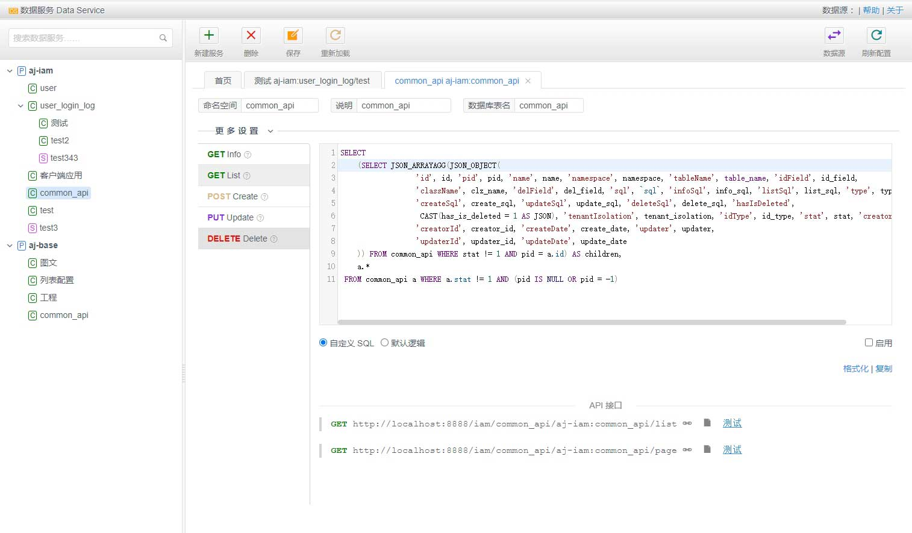

# AJ DataService Introduction

<h4>Quickly build CRUD interface services by writing SQL business logic (or even no code at
all!)</h4> 
— The easiest way: zero code. Configure parameters on the
page, SQL is automatically generated and converted into HTTP
API.
  
<a href="../../../demo/data-service" target="_blank">
Try the Demo</a>, Account: admin, Password: 123123
 
 In Java enterprise development, writing Model, DAO, Service,
and Controller code is often a tedious and repetitive task. AJ DataService was created to solve this problem. Depending
on the complexity of the business logic, DataService can be used in the following three modes: 
 <ul> <li><strong>
Basic data</strong>: These tables typically have little or only simple business logic. You can use DataService to create
generic CRUD services.</li> <li><strong>Custom business logic</strong>: Not limited to simple CRUD, but can still be
implemented using SQL. No need to write additional Java business code. Particularly suitable for backend interface
development for BI reports or data visualization dashboards.</li> <li><strong>Complex business logic</strong>: Requires
both Java and SQL working together. In this case, DataService can still act as an ORM mechanism, functioning as a Data
Access Object (DAO) that returns Java Bean entities.</li> </ul> 
 DataService is not a code generator. More
accurately, it abstracts common CRUD tasks and makes them configurable, serving as a rapid business development
tool. 
 